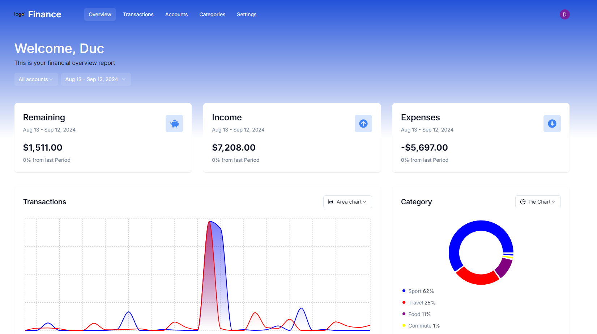

# Finance SaaS Platform

Welcome to the **Finance SaaS Platform** – your all-in-one solution to effectively track and manage your finances. Easily monitor your income and expenses, categorize transactions, and gain insights into your financial health with our powerful, interactive tools.

## 🌐 Live Demo

Check out the live app here: [Finance SaaS Platform](https://finance-me-kappa.vercel.app/)

## 🌟 Key Features

- **📊 Interactive Financial Dashboard**: Visualize your financial data with a dynamic dashboard.
- **🔁 Changeable Chart Types**: Customize the way you view your data with different chart options.
- **🗓 Account and Date Filters**: Filter transactions by specific accounts or date ranges.
- **💹 Detailed Transactions Table**: See all your transactions at a glance in a detailed, sortable table.
- **➕ Add Transactions**: Add new income or expenses quickly with a user-friendly form.
- **🧩 Customizable Select Components**: Tailor dropdowns and selection menus to your preferences.
- **💵 Income and Expense Toggle**: Switch between viewing income and expenses seamlessly.
- **🔄 CSV Transaction Imports**: Import transactions from CSV files to streamline your data management.
- **🔥 API via Hono.js**: Leverage our powerful API built with Hono.js for integration and automation.
- **🪝 State Management via Tanstack React Query**: Efficiently manage app state with Tanstack React Query.
- **🔐 Authentication via Clerk (Core 2)**: Secure your app with robust authentication using Clerk.
- **🗑 Bulk Delete and Search in Transactions**: Easily find and manage multiple transactions at once.
- **👤 User Settings Customization**: Personalize your experience with customizable user settings.

## 🛠️ Tech Stack

- **🌐 Built with Next.js 14**: Leverage the power and performance of Next.js.
- **🎨 Styled with TailwindCSS and Shadcn UI**: Enjoy a modern and responsive design with TailwindCSS and Shadcn UI components.
- **💾 PostgreSQL & Drizzle ORM**: Robust data management with PostgreSQL and Drizzle ORM.
- **🚀 Deployed on Vercel**: Fast, reliable deployment and hosting with Vercel.

## Screenshot

